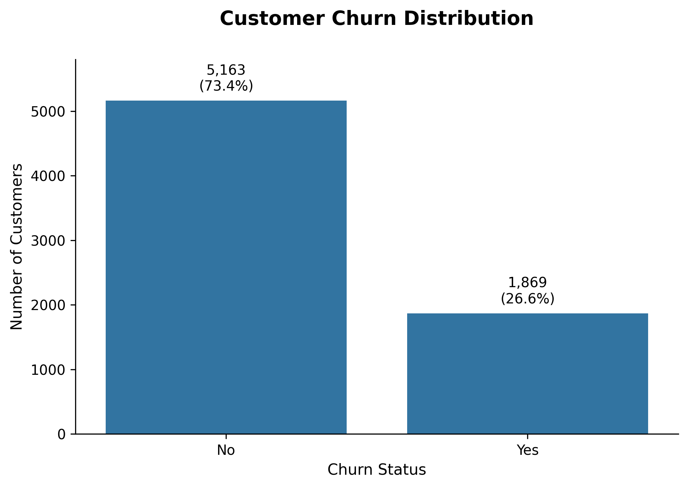
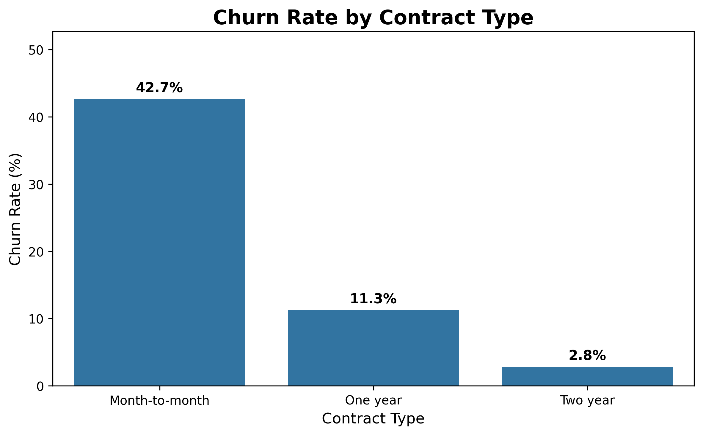
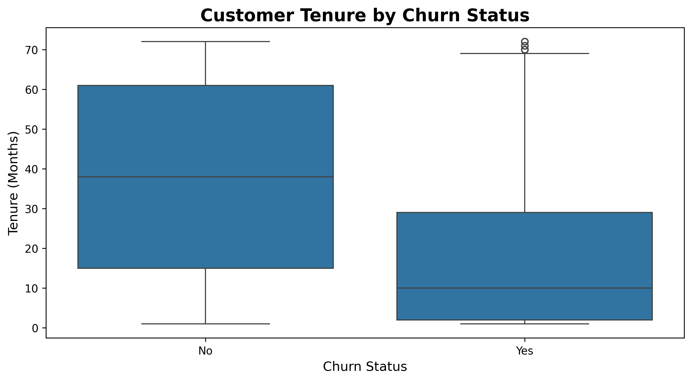
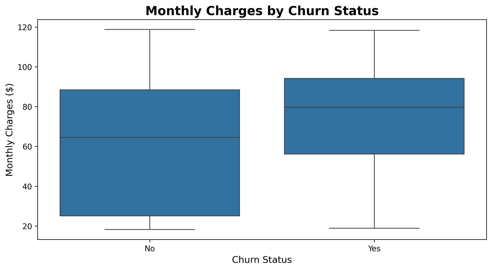
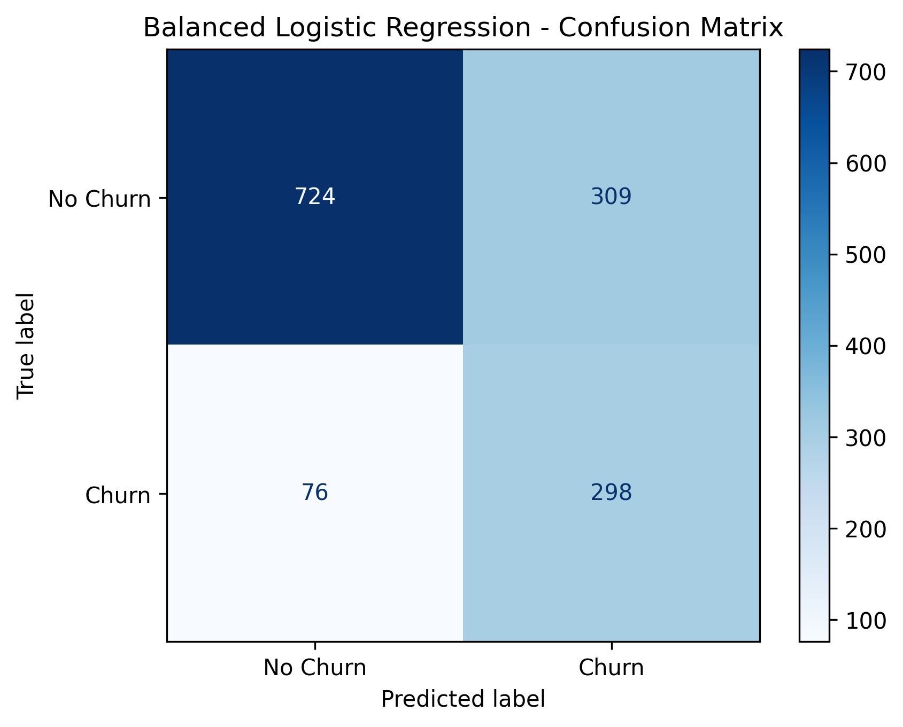
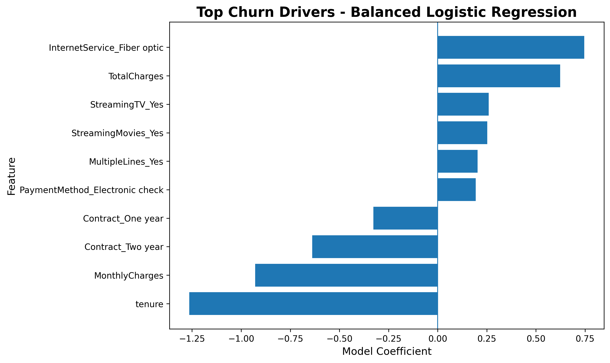

# 📉 Customer Churn Prediction

## Project Overview

This project analyzes customer churn in a telecommunications dataset and develops machine learning models to identify customers at risk of leaving.

The project combines exploratory data analysis, preprocessing, predictive modeling, model evaluation, and business-oriented interpretation. Particular attention is given to recall because failing to identify an actual churner may be more costly than contacting a customer who would otherwise remain.

The final selected model is a **Balanced Logistic Regression**, which identifies **79.7% of actual churners** while maintaining a ROC-AUC of **0.835**.

## 🎯 Business Problem

Customer churn directly affects recurring revenue and customer acquisition costs. The objective of this project is not only to predict churn, but also to identify patterns that can support targeted customer-retention strategies.

The analysis focuses on three questions:

- Which customers are most likely to churn?
- Which customer characteristics are most strongly associated with predicted churn?
- How can the model support practical retention decisions?

## 🤖 Machine Learning Results

Three classification models were evaluated:

| Model | Accuracy | Precision | Recall | F1-score | ROC-AUC |
|---|---:|---:|---:|---:|---:|
| Logistic Regression | 0.804 | 0.648 | 0.575 | 0.609 | 0.836 |
| Random Forest | 0.787 | 0.629 | 0.489 | 0.550 | 0.820 |
| **Balanced Logistic Regression** | **0.726** | **0.491** | **0.797** | **0.608** | **0.835** |

### Final Model Selection

**Balanced Logistic Regression** was selected as the preferred model.

Although standard Logistic Regression achieved higher accuracy and precision, class weighting increased churn recall from **57.5% to 79.7%**.

The selected model correctly identified **298 of 374 actual churners**, reducing false negatives from **159 to 76**.

This trade-off is appropriate for a customer-retention use case where identifying a larger proportion of at-risk customers is prioritized.

---

## 🧱 Project Structure

```
customer-churn-prediction/
│
├── data/
│   └── telco_customer_churn.csv      # Original dataset
│
├── images/
│   ├── churn_distribution.png
│   ├── churn_by_contract.png
│   ├── monthly_charges_by_churn.png
│   ├── tenure_by_churn.png
│   └── top_churn_drivers.png
│
├── notebooks/
│   └── 01_initial_analysis.ipynb     # EDA, preprocessing, modeling & evaluation
│
├── .gitignore
└── README.md
```

---

## 🛠 Tools & Technologies

- **Python** – data cleaning, preprocessing, exploratory analysis, and modeling
- **pandas** – data manipulation and analysis
- **Matplotlib / Seaborn** – data visualization
- **scikit-learn** – preprocessing, Logistic Regression, Random Forest, class weighting, and model evaluation
- **Jupyter Notebook** – analysis and experimentation
- **Git & GitHub** – version control and project documentation

---
## Exploratory Data Analysis

After data cleaning, the dataset contains **7,032 customer records**.

The target variable shows a moderate class imbalance: **73.4%** of customers were retained, while **26.6%** churned.

This imbalance should be considered during model evaluation, particularly when selecting metrics such as **precision, recall, F1-score, and ROC-AUC**.


---
## Churn Drivers Analysis

### Churn Rate by Contract Type

Customers with **month-to-month contracts have the highest churn rate (42.7%)**, compared with **11.3% for one-year contracts** and only **2.8% for two-year contracts**.



### Customer Tenure by Churn Status

Customers who churn tend to have **substantially shorter tenure** than customers who remain.



### Monthly Charges by Churn Status

Customers who churn tend to have **higher monthly charges** than customers who remain. This suggests that monthly charges may be a useful feature for predicting customer churn.



---

## 🤖 Machine Learning Modeling

After preprocessing the data, three classification approaches were evaluated:

- Logistic Regression
- Random Forest
- Balanced Logistic Regression using class weighting

Because the dataset is moderately imbalanced and the business objective is to identify customers at risk of churn, model evaluation focused not only on accuracy but also on precision, recall, F1-score, and ROC-AUC.

### 📊 Model Comparison

| Model | Accuracy | Precision | Recall | F1-score | ROC-AUC |
|---|---:|---:|---:|---:|---:|
| Logistic Regression | 0.804 | 0.648 | 0.575 | 0.609 | 0.836 |
| Random Forest | 0.787 | 0.629 | 0.489 | 0.550 | 0.820 |
| **Balanced Logistic Regression** | **0.726** | **0.491** | **0.797** | **0.608** | **0.835** |

### Confusion Matrix – Selected Model

The Balanced Logistic Regression model correctly identified **298 of 374 actual churners**, achieving a recall of **79.7%** and reducing false negatives to **76**.



### 🎯 Churn Driver Analysis

The selected Balanced Logistic Regression model was also used to examine the strongest features associated with predicted churn.



Key patterns include:

- **Fiber-optic internet service** is associated with higher predicted churn.
- **Longer tenure** is strongly associated with lower predicted churn.
- **Two-year and one-year contracts** are associated with lower predicted churn.
- The coefficient analysis describes associations within the model and should not be interpreted as causal effects.

---
## 📊 Key Insights

- **Churn Rate:** 26.6% of customers in the cleaned dataset churned.
- **Contract Type:** Month-to-month customers show substantially higher churn than customers on longer-term contracts.
- **Customer Tenure:** Customers who churn tend to have shorter tenure, suggesting that newer customers are more vulnerable to churn.
- **Monthly Charges:** Churned customers tend to have higher monthly charges than retained customers.
- **Model Performance:** After hyperparameter tuning and threshold optimization, the Balanced Logistic Regression achieved **87.2% recall** at a decision threshold of **0.4**, prioritizing the identification of customers at risk of churn.
- **Churn Drivers:** The selected model associates **fiber-optic internet service** with higher predicted churn, while **longer tenure** and **one-year/two-year contracts** are associated with lower predicted churn.
- **Business Implication:** Retention efforts could prioritize customers with short tenure, month-to-month contracts, and other characteristics associated with higher predicted churn.

---
## ✅ Project Status

- [x] Dataset added
- [x] Initial exploratory analysis
- [x] Data cleaning & preprocessing
- [x] Feature engineering
- [x] Machine learning modeling
- [x] Model comparison & evaluation
- [x] Balanced Logistic Regression selected
- [x] Churn driver analysis
- [x] Business-oriented interpretation
- [x] Cross-validation
- [x] Hyperparameter tuning
- [x] Threshold optimization
- [x] Additional model experimentation with Gradient Boosting

### 🚀 Next Step

- [ ] Deployment as a simple churn-risk prediction application
